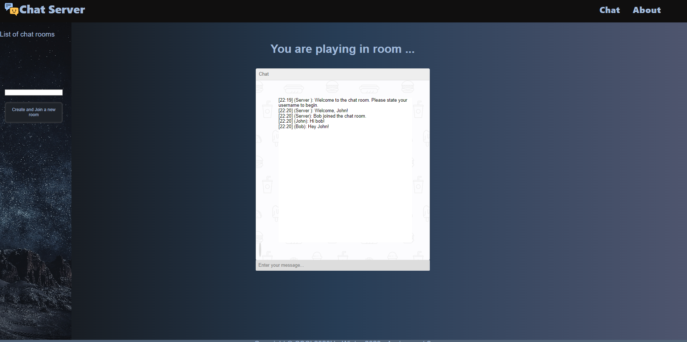
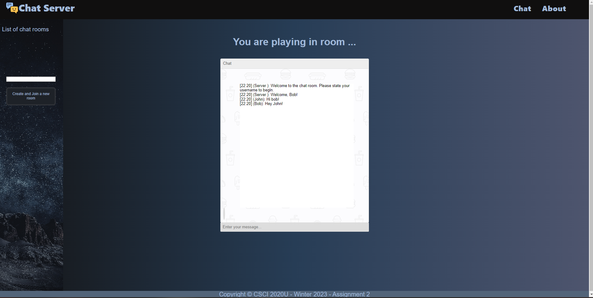
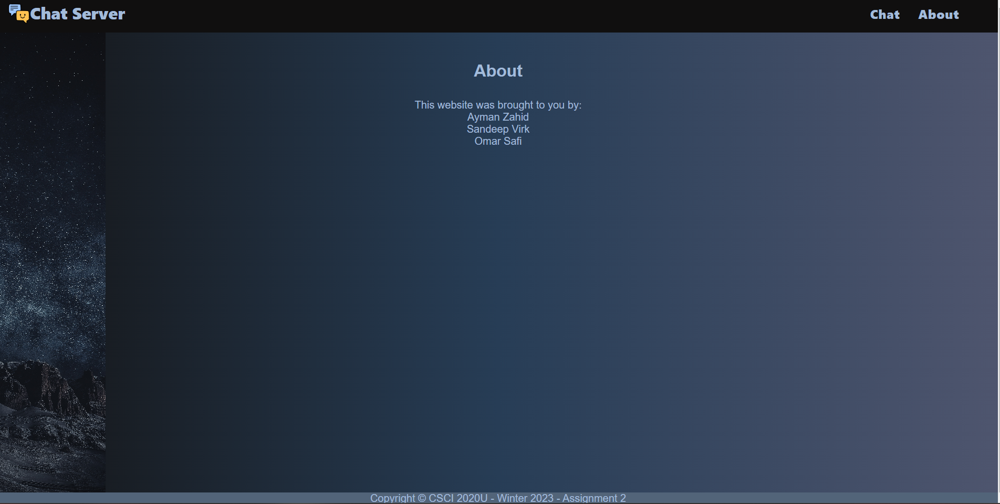

# Assignment 02 - Web Chat Server

> Course: CSCI 2020U: Software Systems Development and Integration

The Interactions:
We can list the all the usernames that are in a room.
Add the users status.
Add profile images for each user.

A)
Project information:

The project was to create a web chat server with multiple rooms. Which will allow you and your friends to chat privately.

Index.html

About.html

Group Members:
Sandeep Virk
Ayman Zahid
Omar Safi

B)
Improvements:
Added a logo with the title. Used a function liner-gradient() for the background-image for both the index.html and about.html and set it to the right, with three different colours. Added a background image for the sidebar. Modified the chat box to make it look aesthetically pleasing. Changed the font colours to match and blend in with the background.

C)
Clone in github using git bash Go on the repository URL of the assignment. Copy the url and open git on gitbash
and then git clone url link and open the file. Once you open the intellij file go to the main folder open it then go on src then open the java folder. Click on any jave file. Before you run the program. Edit configuration click add then go on glassfish server click on local. Then you go on deployments add artifact and choose csci2020u-assignment02-Safi-Virk-Zahid war exploded. Now go back to server make sure your URL is http://localhost:8080/WSChatServer-1.0-SNAPSHOT/. Have JRE JDK19 or up. Serve Domain should be domain1 and apply and press OK and your good to go. Run Glass fish server and your index.html will pop up automatically and now you can join a chat room and chat with multiple clients.

D) We used class labs and class assignments.
